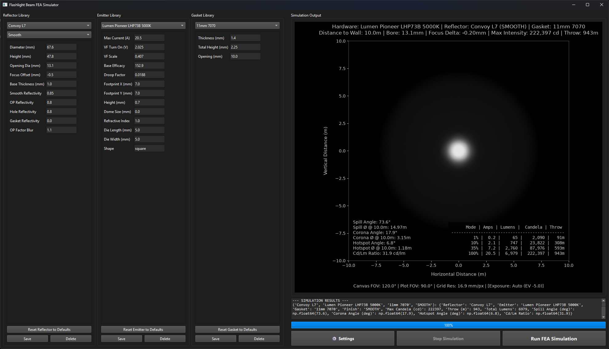

# Flashlight FEA Ray-Tracing Simulator

A hardware-accelerated finite element analysis (FEA) ray-tracing simulator for modeling flashlight beam profiles.

The simulator performs physics-based optical simulations of flashlight systems, including LED emission, silicone dome refraction, parabolic reflector reflections, gasket shadowing, and beam projection onto a virtual target. It can use NVIDIA CUDA for hardware acceleration or automatically fall back to a CPU ray tracer.

---

# Features

* Physics-based ray tracing
* Finite element LED emitter modeling
* Silicone dome refraction
* Smooth and Orange Peel reflector simulation
* CUDA GPU acceleration
* Automatic CPU fallback
* Wall-shot visualization
* Beam intensity profile plots
* Persistent simulation settings

---

# Screenshots



---

# Installation

There are two ways to use the simulator.

## Option 1 (Recommended): Download the Prebuilt Release

Most users should download the latest compiled release from the project's **GitHub Releases** page.

1. Download the latest release ZIP
2. Extract
3. Run:

```text
flashlight-sim.exe
```

No installation is required.

If a compatible NVIDIA GPU is available, the simulator automatically enables CUDA acceleration. Otherwise, it automatically uses the CPU ray tracer.

---

## Option 2: Build from Source

Building from source is only required if you want to:

* Modify the simulator
* Contribute code
* Add new features
* Edit the ray-tracing engine
* Build your own executable

See the **Developer Setup** section below.

---

# Running a Simulation

Launch the application.

Select:

* Reflector
* LED Emitter
* Gasket
* Reflector Finish

Click **Run FEA Simulation**.

Simulation progress is displayed in the progress bar while detailed status messages and final results appear in the log window.

The generated beam image is displayed directly inside the application.

---

# Hardware Library

Hardware definitions are stored in:

```text
hardware_library.json
```

The simulator supports three hardware categories:

* Emitters
* Reflectors
* Gaskets

The hardware library can be edited directly within the application or manually by editing the JSON file.

Changes made in the editor only affect the current simulation unless they are explicitly saved.

---

# Simulation Settings

Simulation settings are stored in:

```text
simulation_settings.json
```

Default values are stored in:

```text
default_settings.json
```

The settings dialog allows every parameter to be modified without editing JSON files manually.

---

# Simulation Settings Explained

## Output & Rendering

### Generate All Plots

Generates every available output plot instead of only the primary wall-shot image.

Not very useful right now. To be done in future.

---

### Plot Wall Shot

Generates the simulated beam projected onto the target wall.

---

### Plot Intensity Profiles

Generates beam intensity cross-sections along:

* Horizontal axis
* Vertical axis
* 45° diagonal

These plots are useful for analyzing hotspot shape, corona, and spill.
They will be saved to the output directory when "Explort Plots" is enabled.

---

### Show Human Silhouette

Displays a human silhouette on the wall-shot image to provide a sense of beam size and throw.

---

### Export CSV

Exports calculated simulation results to CSV files.

---

### Export Plots

Automatically saves generated plots as image files.

---

### Output Directory

Specifies where exported CSV files and images are saved.

---

# Simulation Space & Constraints

## Use GPU Acceleration

Enables CUDA ray tracing.

If CUDA is unavailable or initialization fails, the simulator automatically falls back to the CPU implementation.

---

## Maximum Multiple Reflections

Maximum number of additional reflections permitted after the initial reflector bounce.

Increasing this value improves realism for complex reflector geometries but increases computation time.

---

## Force Reflector Opening Size

Uses the reflector opening diameter exactly as specified in the reflector library.

When disabled, the simulator automatically enlarges the opening if necessary to prevent clipping by the LED package.

---

## Target Distance

Distance between the flashlight and the simulated wall.

---

## Canvas Field of View

Controls the total simulated wall area.

Used to determine the wall grid resolution. Should not need to be changed.

---

## Plot Field of View

Controls how much of the simulated wall is displayed in output figures.

---

# Camera Settings

These settings affect only the rendered wall-shot appearance.

They do not affect the underlying optical calculations.

---

## Auto Exposure

Automatically selects camera exposure.

---

## Exposure Compensation

Applies an exposure offset in EV.

---

## ISO

Virtual camera sensitivity.

---

## f-stop

Virtual camera aperture.

---

## Shutter Speed

Virtual camera exposure time.

---

# Resolution & Angular Density

These settings control simulation accuracy and runtime.

---

## Simulation Grid Resolution

Resolution of the wall illumination grid.

Higher values produce smoother output images but require additional processing.

---

## Emitter Subdivision Elements

The LED die is divided into many finite elements.

Each element acts as an independent light source.

Higher subdivision counts improve accuracy but increase simulation time.

---

## Theta Step

Angular spacing between emitted rays in elevation.

Smaller values increase angular sampling density.

---

## Phi Step

Angular spacing around the LED.

Smaller values produce smoother beam profiles.

---

## Theta and Phi Limits

Restrict the angular emission range.

These settings are useful for specialized optical analysis.

---

## Lumen Calculation Step

Controls the angular integration resolution used during lumen calculations.

---

# Material Defaults & Thresholds

These values provide defaults whenever individual hardware entries do not specify them.

They include:

* Smooth reflector reflectivity
* Orange Peel reflector reflectivity
* Reflector opening reflectivity
* Gasket reflectivity
* Orange Peel blur strength
* Spill visibility threshold
* Corona visibility threshold
* Hotspot threshold
* Default gasket dimensions
* Default reflector dimensions
* Default focus offset

---

# LED Model

Each emitter definition contains electrical and optical parameters describing LED performance.

## Forward Voltage

Forward voltage is estimated using a logarithmic approximation:

```text
Forward Voltage =
Vf Turn-On +
(Vf Scale × ln(Current + 1))
```

This approximates the nonlinear increase in LED forward voltage as drive current rises.

---

## Electrical Power

Electrical power is calculated as:

```text
Power =
Current × Forward Voltage
```

---

## Luminous Efficiency

LED efficiency decreases as current increases due to efficiency droop.

The simulator models this behavior using an exponential decay:

```text
Efficiency =
Base Efficacy × exp(-Droop Factor × Current)
```

where:

* **Base Efficacy** is the LED efficiency at low current (lm/W)
* **Droop Factor** determines how rapidly efficiency decreases with increasing current

---

## Total Luminous Flux

Total light output is calculated as:

```text
Lumens =
Electrical Power × Efficiency
```

This model provides a computationally efficient approximation of real LED performance over a wide operating range.

---

# GPU Acceleration

The simulator uses:

* Numba
* CUDA
* NVIDIA NVVM

When a compatible CUDA environment is available, ray tracing executes on the GPU.

If CUDA cannot be initialized, the simulator automatically switches to the CPU implementation without requiring any configuration changes.

---

# Developer Setup

This section is only required if you intend to modify the source code.

## Requirements

* Python 3.11
* Anaconda
* Visual Studio Code (recommended)

CUDA Toolkit 11.8 is optional but recommended for GPU development.

---

## Clone the Repository

```bash
git clone https://github.com/<username>/<repository>.git

cd flashlight-fea-raytracer
```

---

## Create a Conda Environment

```bash
conda create -n flashlight python=3.11
```

Activate the environment:

```bash
conda activate flashlight
```

---

## Install Dependencies

```bash
conda install -c conda-forge numpy scipy matplotlib pyqt numba pyinstaller
```

To enable GPU acceleration:

```bash
conda install -c conda-forge cudatoolkit=11.8
```

If required:

```bash
conda install -c conda-forge zlib-wapi
```

---

## Open the Project in VS Code

Open the project folder.

Select the Conda interpreter:

```text
Ctrl + Shift + P

Python: Select Interpreter
```

Choose the **flashlight** Conda environment.

---

## Run from Source

```bash
python flashlight-sim.py
```

or press **F5** to start the debugger.

---

# Building a Release

To create a standalone Windows release:

```bash
python build.py
```

The build script automatically:

* Detects the active Conda environment
* Locates the required CUDA runtime
* Bundles CUDA components
* Packages the application using PyInstaller
* Produces a portable release in:

```text
dist/
    flashlight-sim/
```

The generated folder can be distributed directly to end users.

No Python installation is required on the target machine.

---

# Project Structure

```text
flashlight-sim.py          PyQt6 application
fea_engine.py              Ray-tracing engine
build.py                   Release builder

mainwindow.ui              User interface
hardware_library.json      Hardware database
default_settings.json      Default settings
simulation_settings.json   User settings
```

---

# License

This project is licensed under the **GNU General Public License v3.0 (GPL-3.0)**.

You are free to use, modify, and redistribute this software under the terms of the GNU GPL v3.

See the `LICENSE` file for the complete license text.

---

# Acknowledgements

This project makes use of the following open-source libraries:

* PyQt6
* NumPy
* SciPy
* Matplotlib
* Numba
* CUDA Toolkit
* PyInstaller

These libraries provide the scientific computing, visualization, GPU acceleration, and application packaging capabilities used throughout the simulator.
